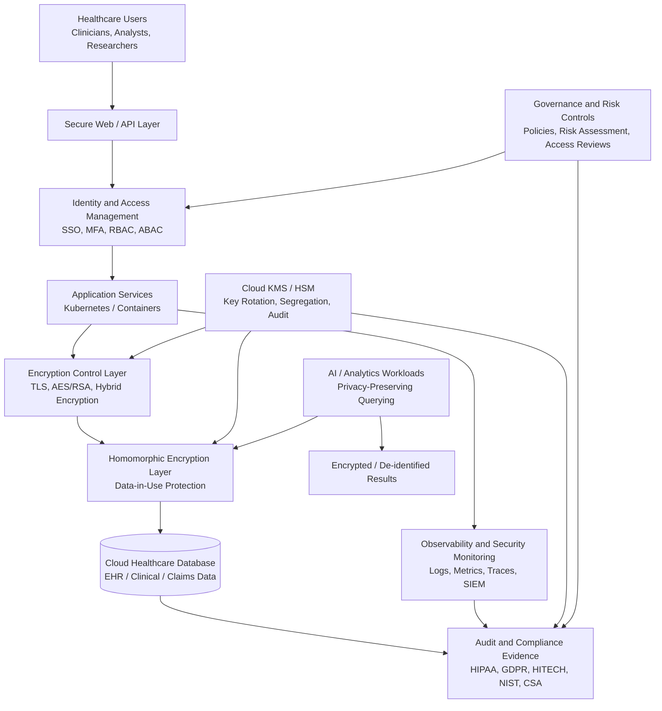

# HE/Cloud Security Architecture Diagram

This diagram shows a privacy-preserving architecture for cloud-based healthcare databases using homomorphic encryption, cloud security controls, key management, observability, and compliance governance.

## Architecture Summary

The architecture protects healthcare data across three major states:

| Data State | Primary Controls | Research Relevance |
|---|---|---|
| Data in transit | TLS, API security, identity controls | Prevents interception and unauthorized access |
| Data at rest | AES, cloud database encryption, KMS/HSM | Protects stored healthcare records |
| Data in use | Homomorphic encryption / privacy-preserving computation | Reduces exposure during query and analytics processing |

## Research Contribution

This architecture supports the research argument that healthcare cloud security should not rely only on traditional encryption at rest and in transit. For sensitive healthcare analytics and AI workloads, data-in-use protection is a critical layer for privacy-preserving computation and compliance-aware system design.
